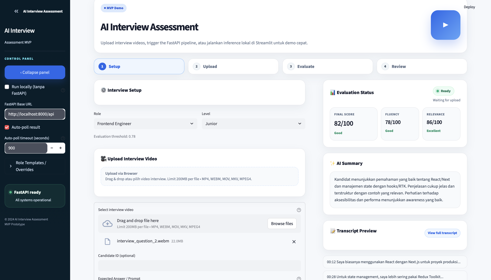
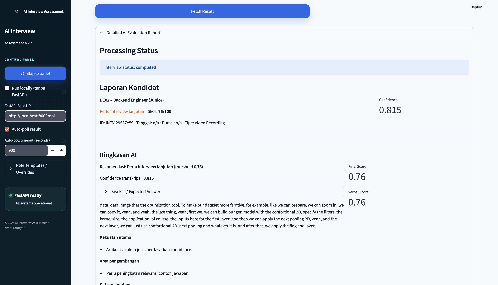
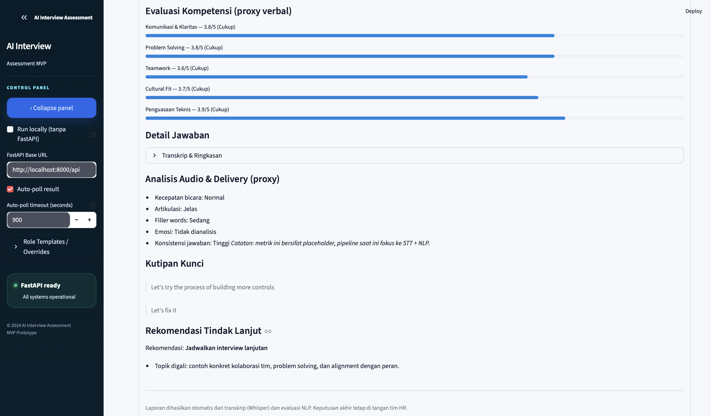

# AI Interview Evaluation System

Full-stack AI interview analysis MVP focused on speech transcription, verbal response scoring, and recruiter-friendly reporting.

The current MVP accepts recorded interview videos, extracts audio, transcribes speech with local Whisper, scores verbal responses with NLP models, stores results in PostgreSQL, and presents reports through Streamlit and Next.js prototypes.

> Note: Vision-based/non-verbal analysis and cheating detection are present only as experimental extension code/dependencies. They are not active in the main processing pipeline.

## Demo Preview

### Streamlit Prototype

The Streamlit prototype provides a polished recruiter-facing interface for setting up an interview assessment, uploading a video, triggering the FastAPI pipeline, and reviewing the generated transcription and verbal evaluation report.

#### Upload & Setup



#### Evaluation Summary



#### Detailed Report



> Architecture diagram placeholder: add `../docs/images/architecture.png` when a visual system overview is available.

## What This Project Does

- Uploads recorded interview video through FastAPI, Streamlit, or the Next.js dashboard prototype.
- Extracts 16 kHz mono audio from video files using `ffmpeg`.
- Transcribes speech using a configurable local Whisper model.
- Scores verbal responses for fluency, relevance, confidence, and final verbal score.
- Persists interview, transcript, and NLP score records in PostgreSQL with SQLAlchemy.
- Displays recruiter-friendly summaries through Streamlit and a Next.js/Prisma dashboard.
- Includes an STT evaluation script for labeled audio/transcript samples.

## Current Features

- FastAPI backend with documented upload/result endpoints.
- Whisper-based speech-to-text pipeline.
- NLP-based verbal response scoring.
- PostgreSQL persistence through active SQLAlchemy models.
- Streamlit prototype for upload and report review.
- Next.js dashboard prototype backed by Prisma.
- Docker-ready backend setup.
- Environment examples for backend and frontend configuration.

## Not Active Yet / Planned

- Vision-based/non-verbal scoring in the main processing pipeline.
- Cheating detection pipeline in production flow.
- Durable task queue for long-running jobs.
- Authentication and role-based access control.
- Cloud object storage for media and generated artifacts.
- CI/CD, automated test coverage, and hosted demo deployment.

## Tech Stack

| Layer | Tools |
| --- | --- |
| Backend | FastAPI, Uvicorn, SQLAlchemy |
| Speech-to-Text | OpenAI Whisper, ffmpeg |
| NLP | HuggingFace Transformers, Torch, SentencePiece |
| Database | PostgreSQL, SQLAlchemy, Prisma |
| Interfaces | Streamlit, Next.js, React |
| Tooling | Docker, python-dotenv, TypeScript, ESLint |
| Experimental Extensions | YOLOv8, Mediapipe, OpenCV, MinIO/S3 |

## Architecture Overview

```text
Video Upload
    │
    ├── Streamlit prototype / Next.js dashboard / FastAPI API
    │
FastAPI Backend
    │
    ├── Store temporary upload in uploads/
    ├── Extract audio with ffmpeg
    ├── Transcribe speech with Whisper
    ├── Score transcript with NLP models
    ├── Aggregate verbal report
    └── Persist Interview, Transcript, and NLPScore records
    │
PostgreSQL Database
    │
    ├── Next.js dashboard reads via Prisma
    └── Result endpoint returns report status/details
```

A visual diagram should be added at `../docs/images/architecture.png` before sharing the repository publicly.

## Repository Layout

```text
ai_interview_project/
├── app/                         # FastAPI application
│   ├── main.py                  # App factory, CORS, health, DB startup
│   ├── db.py                    # SQLAlchemy engine/session setup
│   ├── routes/interview_routes.py
│   ├── models/                  # DB models + ML wrappers
│   ├── services/stt_service.py  # Whisper transcription service
│   └── utils/                   # Audio, NLP, report, vision helpers
├── frontend/                    # Next.js + Prisma dashboard prototype
├── streamlit_frontend/          # Streamlit prototype UI
├── scripts/                     # STT evaluation/fine-tuning utilities
├── data/                        # Local datasets/generated DB files; ignored except .gitkeep
├── outputs/                     # Generated audio/transcript artifacts; ignored
├── uploads/                     # Temporary uploaded videos; ignored
├── requirements.txt             # Backend + ML dependencies
├── Dockerfile                   # Backend container image
├── .env.example                 # Backend env sample
└── README.md
```

## How to Run Locally

### Prerequisites

- Python 3.10+
- Node.js 18+ and npm
- `ffmpeg` available on `PATH`
- PostgreSQL database reachable from backend and frontend
- Optional: Docker Desktop for backend container workflow

### Backend API

```bash
cd ai_interview_project
cp .env.example .env
python3 -m venv .venv
source .venv/bin/activate
python -m pip install --upgrade pip
python -m pip install -r requirements.txt
python -m uvicorn app.main:app --host 0.0.0.0 --port 8000 --reload
```

Windows virtualenv activation:

```powershell
.\.venv\Scripts\activate
```

The backend requires `DATABASE_URL` and creates SQLAlchemy tables on startup with `Base.metadata.create_all()`.

### Streamlit Prototype

```bash
cd ai_interview_project
streamlit run streamlit_frontend/streamlit_app.py
```

Open `http://localhost:8501`. The Streamlit UI uses `NEXT_PUBLIC_API_BASE_URL` when available, otherwise defaults to `http://localhost:8000/api`.

### Next.js Dashboard Prototype

```bash
cd ai_interview_project/frontend
cp .env.example .env
npm install
npx prisma generate
npm run dev
```

Open `http://localhost:3000`.

Run Prisma migrations only when you intentionally want Prisma to manage schema changes:

```bash
npx prisma migrate dev --name init
```

### Docker Backend

```bash
cd ai_interview_project
docker build -t ai-interview-api .
docker run --rm -p 8000:8000 --env-file .env ai-interview-api
```

If PostgreSQL runs on the host machine, update `DATABASE_URL` so it is reachable from inside the container; container `localhost` usually does not point to the host database.

## API Endpoints

Swagger UI: `http://localhost:8000/docs`

| Method | Path | Description |
| --- | --- | --- |
| `GET` | `/health` | Service heartbeat |
| `POST` | `/api/interviews/upload` | Upload interview video with `file`, optional `candidate_id`, optional `expected_answer` |
| `GET` | `/api/interviews/result/{interview_id}` | Poll processing status or completed report |

## Environment Variables

Backend `.env`:

| Variable | Required | Description |
| --- | --- | --- |
| `DATABASE_URL` | Yes | PostgreSQL connection string. No automatic SQLite fallback exists. |
| `LOG_LEVEL` | No | Python logging level, default `INFO`. |
| `WHISPER_MODEL_SIZE` | No | Whisper model size, default sample value is `base.en`. |
| `WHISPER_DEVICE` | No | Optional device override such as `cuda`; blank uses default device selection. |
| `AWS_ACCESS_KEY`, `AWS_SECRET_KEY`, `S3_BUCKET_NAME` | No | Reserved for future S3 usage. |
| `MINIO_ENDPOINT`, `MINIO_ACCESS_KEY`, `MINIO_SECRET_KEY` | No | Reserved for future MinIO usage. |

Frontend `.env`:

| Variable | Required | Description |
| --- | --- | --- |
| `DATABASE_URL` | Yes | PostgreSQL URL used by Prisma. |
| `NEXT_PUBLIC_API_BASE_URL` | No | FastAPI base URL, usually `http://localhost:8000/api`. |

Never commit real `.env` secrets.

## STT Accuracy Validation

Prepare audio files and matching transcripts in one directory, for example `sample01.wav` and `sample01.txt`.

```bash
cd ai_interview_project
python -m scripts.evaluate_stt --dataset-dir ./data/stt_eval --model-size medium.en
```

Optional arguments:

- `--device cuda` to run Whisper on GPU.
- `--limit N` to evaluate only the first N samples.

The script exits with a non-zero status when overall accuracy is below `0.90`.

## Known Limitations

- `DATABASE_URL` is required; the app does not automatically fall back to SQLite.
- Vision/non-verbal/cheating metrics are modeled in parts of the codebase but are not written by the current backend pipeline.
- Uploaded media and generated audio are handled on local disk, not cloud object storage.
- Background processing uses FastAPI background tasks, not a durable queue; long jobs can be affected by server restarts.
- The Next.js dashboard is a prototype and does not include authentication or RBAC.

## Portfolio Assets

- [x] `../docs/images/streamlit-upload.png` — clean upload/setup screen with API base URL visible.
- [x] `../docs/images/streamlit-report.png` — evaluation summary using non-sensitive sample data.
- [x] `../docs/images/streamlit-detailed-report.png` — detailed report/transcript view.
- [ ] `../docs/images/architecture.png` — simple architecture diagram matching the flow in this README.

## GitHub About Suggestion

Description:

```text
Full-stack AI interview analysis MVP using FastAPI, Whisper, NLP scoring, PostgreSQL, Next.js, and Streamlit.
```

Topics:

```text
fastapi, whisper, nlp, interview-analysis, streamlit, nextjs, postgresql, sqlalchemy, machine-learning, portfolio-project
```

## Roadmap

- Add durable async processing with Celery, Dramatiq, RQ, or another queue.
- Activate and persist vision/non-verbal metrics after validation.
- Add authentication and role-based access control for recruiter/HR workflows.
- Add report detail pages, charts, and transcript drill-downs.
- Wire cloud object storage for raw media and generated artifacts.
- Add automated backend/frontend tests and CI/CD.
